# Develop your idea

After planning for the work, we enter the stage where it is time to implement the idea in the source code. 

This is a diagram view of how this stage proceed:

```mermaid
   flowchart LR

      %% Define all the nodes first
      clone[Clone repository]:::uniq ;
      locbranch(["Create local branch: <br> git checkout &lt;branchname&gt;"]):::term;
      edits[Modify the source code]:::term;
      add["Add your edits to git's index: <br> git add ."]:::term;
      commit["Commit your edits locally: <br> git commit"]:::term;
      push[Push your edits to GitHub: <br> git push]:::term;
      pr([Create a pull request]):::github;
      tests[\Do the tests pass?/]:::question;
      review[Ready for review];

      clone --> locbranch--> edits;
      edits --> add --> commit --> push;
      push --> |first time|pr --> tests;
      push ----> |subsequent|tests;
      tests -->|Yes|review;
      tests -->|No|edits;

      classDef default fill:#FFFDE7, stroke:#FFF59D;
      classDef uniq fill:#D81B60,stroke:#880E4F,color:#FFFFFF;
      classDef github fill:#388E3C,stroke:#1B5E20,color:#FFFFFF;
      classDef term fill:#F44336,stroke:#B71C1C,color:#FFFFFF;
      classDef question fill:#6D4C41,stroke:#3E2723,color:#FFFFFF; 

      linkStyle 9 stroke:red,color:red;
      linkStyle 8 stroke:green,color:darkgreen;

      click review "https://cable.readthedocs.io/en/latest/developer_guide/contribution_flowchart/#review" "Review process"

;
```



## Get your copy of the software

!!! note "First time only"

    You only need to clone the repository on your work machine the first time you work on a development for CABLE. The subsequent times, you can work from the same copy of the repository. To learn more how to prepare for new work after finishing some contribution, please refer to the final steps documentation.

If you are a member of the CABLE-LSM organisation on GitHub, you can simply work from a locally cloned copy of the repository. You do not need to create a fork of the GitHub repository. To become a member of the CABLE-LSM organisation, please reply on [this issue][new_member]

??? tip "How to"
    [How to clone][how_to_clone]

## Create a branch for your issue

Once you decide to start on an issue, you need two actions on GitHub CABLE's repository:

1. [Assign yourself][assign_issue] to the issue. This indicates to the community you are activelly working on the issue. It does not have to be the same as the reporter of the issue.
2. [Create a branch][create_branch] on the repository for you to work on. This allows you to isolate your work from others' work, thus controlling the changes made to the code.

!!! warning "Branch naming convention"

    We would like all branches to follow the GitHub naming convention: `<issue_number>-<issue-title-with-dashes>`. If your issue title is too long, some shortening in the branch name is acceptable. A branch created following the methodology above will follow that convention.
    In VS Code, the GitHub Pull Requests and Issues extension allows you to specify the branch template in the settings:
    ```
    "githubIssues.issueBranchTitle": "${issueNumber}-${sanitizedIssueTitle}"
    ```

!!! tip "Branches are writable by all"

    Contrary to SVN, in GitHub, the branches are writeable by everyone. This means collaboration on code development can happen on all branches, there is no need to open special branches for collaboration.

[how_to_clone]: resources/how_to.md#cloning-a-repository
[new_member]: https://github.com/CABLE-LSM/CABLE/issues/110
[assign_issue]:
[create_branch]: