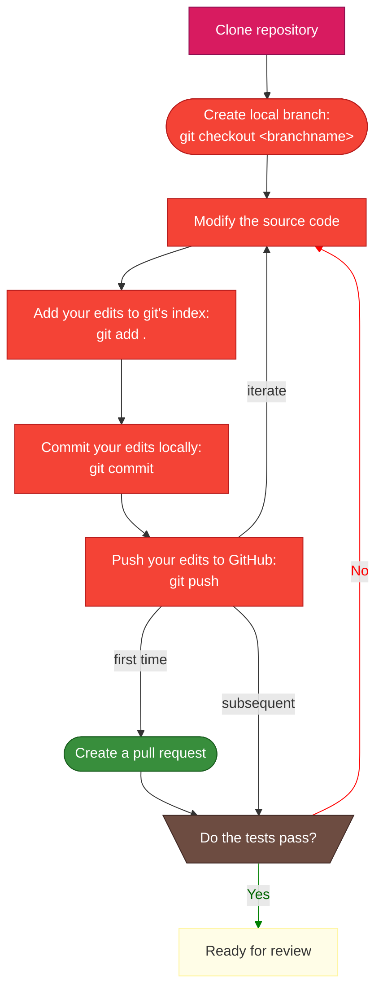

# Develop your idea

After planning for the work, we enter the stage where it is time to implement the idea in the source code. 

This is a diagram view of how this stage proceed:



## Get your copy of the software

!!! note "First time only"

    You only need to clone the repository on your work machine the first time you work on a development for CABLE. The subsequent times, you can work from the same copy of the repository. To learn more how to prepare for new work after finishing some contribution, please refer to the final steps documentation.

If you are a member of the CABLE-LSM organisation on GitHub, you can simply **[clone the repository locally][how_to_clone]**. You do not need to create a fork of the GitHub repository. To become a member of the CABLE-LSM organisation, please reply on [this issue][new_member]

## Create a branch for your issue

Once you decide to start on an issue, you need two actions on GitHub CABLE's repository:

1. **[Assign yourself to the issue.][assign_issue]** This indicates to the community you are actively working on the issue. You do not need to be the creator of the issue to assign yourself an issue. Feel free to work on issues raised by others.
2. **[Create a branch][create_branch]** on the repository for you to work on. This allows you to isolate your work from others' work, thus controlling the changes made to the code in your branch. We recommend you create the branch from the issue page on GitHub (see the details linked previously).

!!! warning "Branch naming convention"

    We would like all branches to follow the GitHub naming convention: `<issue_number>-<issue-title-with-dashes>`. If your issue title is too long, some shortening in the branch name is acceptable. A branch created following the methodology above will follow that convention.

    In VS Code, the GitHub Pull Requests and Issues extension allows you to specify the branch template in the settings:
    ```
    "githubIssues.issueBranchTitle": "${issueNumber}-${sanitizedIssueTitle}"
    ```

!!! tip "Everyone has write access to your branch"

    Contrary to SVN, in GitHub, everyone has write access to the branches except the `main` branch. This means collaboration on code development can happen on all branches, there is no need to open special branches for collaboration.

## Develop your feature

It is now time for you to start working on CABLE and its documentation. Here are a few considerations and advice to consider during your coding work:

1. Follow [**CABLE's coding standards**][coding_standards] for all new work.
2. **Only commit source code and documentation files.** Files to run CABLE should not be committed to the repository. If you want to save a specific configuration for running CABLE or a running script etc., the best option is to save these in a separate repository on GitHub so it can be shared easily.
3. **Implement new features within a new namelist option.** New features should be turned off by default. All new namelist options will require updates to the documentation.
4. **Document your additions/modifications** to the code as you go along, according to the [documentation guidelines][doc_guidelines]. Keep in mind the science needs to be documented within the source code using FORD. Modifications to the User Guide are also done within this CABLE repository and are done using Markdown formatting. Consider being a good citizen by adding more documentation to existing parts of the code if you can!
5. **Keep every commit small.** **Write meaningful commit messages** about what you want to achieve rather than a description of the change. The committed code itself is the description of the change and is often more precise than you can be. (see examples after)
6. **Reference the issue number (format: `#<number>`) in each commit message.** Do not put it at the start of the message since `#` is a comment in shell scripting. (see examples after)
7. **Push your work to the GitHub repository frequently.** For periods of active code development, this could happen daily or weekly. Pushing after each commit is also acceptable. It provides you with:
    1. a backup
    2. the possibility to work from different computers
    3. easy collaboration as any CABLE developer can access an up-to-date version of your branch right away
    4. a platform for getting support from the CABLE maintainers (see [The Pull Request: your communication centre](#the-pull-request-your-communication-centre))
8. **Keep your branch current with the released versions of CABLE.** You are expected to merge into your branch the released versions of CABLE. We will only accept contributions from branches that are up-to-date with the latest released version of CABLE. An exception will be made for legacy work, i.e. work that started a significant amount of time before the transition to git and GitHub.
9. **[Create a Pull Request (PR) on GitHub early on][pr_create]**, ideally after the first commit on your branch. PRs allow the community to know what is being worked on. Keep your PR up-to-date by pushing your work frequently to GitHub.
10. **Test frequently** (see [Testing your work][testing]).

!!! tip "Examples of commit messages"
    Let's say you modified the value of the parameter, `my_param`, from 0.5 to 0.9 because you have read some paper that has proven the updated value is better.

    **Bad commit message:**

    :x: Changed my_param from 0.5 to 0.9. Fixes #123

    **Good commit message:**

    :white_check_mark: Use Doe J. et al. (2500) value for my_param. Fixes #123

## The Pull Request: your communication centre

The Issue is central to plan the work but once the work is being implemented, all discussions around the implementation or review will be done via the pull request. We will consider the list of open pull requests to represent the current developments happening on CABLE.

We will also implement simple technical tests to automatically run on all updates to pull requests. These tests will target things like compilation and execution. Pushing your development to a pull request means you do not need to replicate these tests by hand.

PRs require a description when you open them, this description and the PR title are editable. Our advice is to update them as your work progress as you may realise the scope of your PR changes later on. We will provide a template for the PR description, please read carefully and provide as much of the required information as possible.

**If you have any questions about the implementation of a feature, you can contact another CABLE developer or the CABLE maintainers team via the PR. Mention the people you'd like to contact in a comment with your question to notify them.** For questions on lines of code you have modified, you can leave your comment right with the code which can reduce the risk of confusion.

As we will see next, the pull request will also be used to share test results and review contributions before inclusion in the main CABLE version.

[how_to_clone]: resources/how_to.md#cloning-a-repository
[new_member]: https://github.com/CABLE-LSM/CABLE/issues/110
[assign_issue]: resources/how_to.md#assign-an-issue
[create_branch]: resources/how_to.md#create-a-branch
[pr_create]: resources/how_to.md#create-a-pull-request-pr
[coding_standards]: ../other_resources/coding_standards.md
[testing]: testing.md
[doc_guidelines]: ../documentation_guidelines/index.md