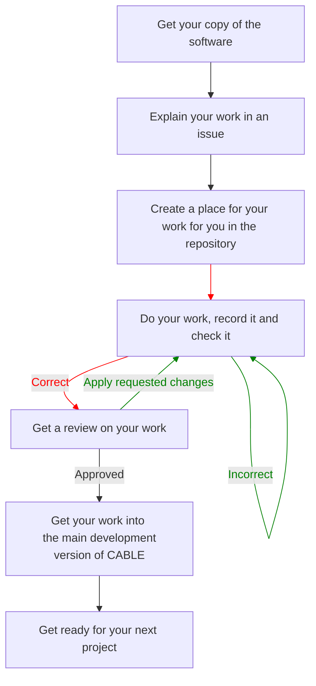

# Contribution guidelines

All new contributors are encouraged to read through these guidelines before working on any development work. All contributors should refer to these guidelines if they have questions on the contribution process.

These guidelines are written from the perspective of a new contributor to CABLE wanting to start their first development. Notes are added when guidelines for subsequent contributions differ.

:material-sim-alert: The CABLE documentation is an integral part of the CABLE code and its repository. The present guidelines apply for changes to the scientific code as well as to the documentation. As such all subsequent reference to "source code" or "code" apply to the code itself or its documentation. All changes to the scientific code **must** be accompanied by adequate changes to the documentation. The changes to the documentation are expected to be part of the same set of changes as the scientific modifications. The documentation changes **must** not be submitted separately, except for corrections. You can refer to [the documentation guidelines][doc-guidelines] to know what level of documentation is expected and how to document code changes.

!!! warning "Pre-requisite before contributing to CABLE"

    Before contributing to CABLE, please ensure you have followed all the steps to [setup Git and GitHub][git-training] given by ACCESS-NRI. Failing this, some of the commands described here may require additional steps or options.

!!! info "Resources"

    Please refer to [this cheat sheet page][cheatsheet] for quick references to Git, Markdown and FORD syntax.

## Process overview

Here is a flowchart explaining how the various steps of the contribution workflow interact together. More details are provided for each step in the following sections of this guide.

[git-training]: https://access-nri.github.io/Training/HowTos/GitAndGitHub/
[doc-guidelines]: ../documentation_guidelines/index.md