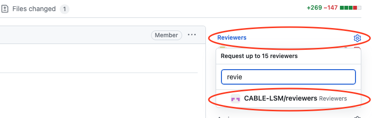
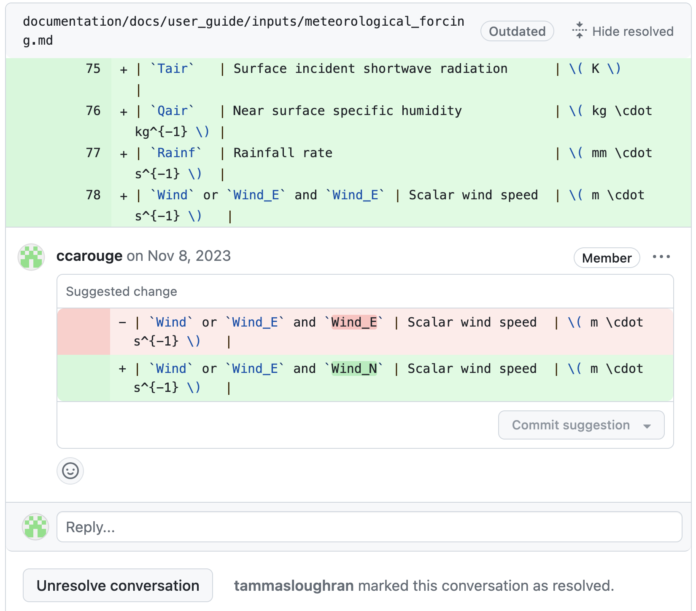
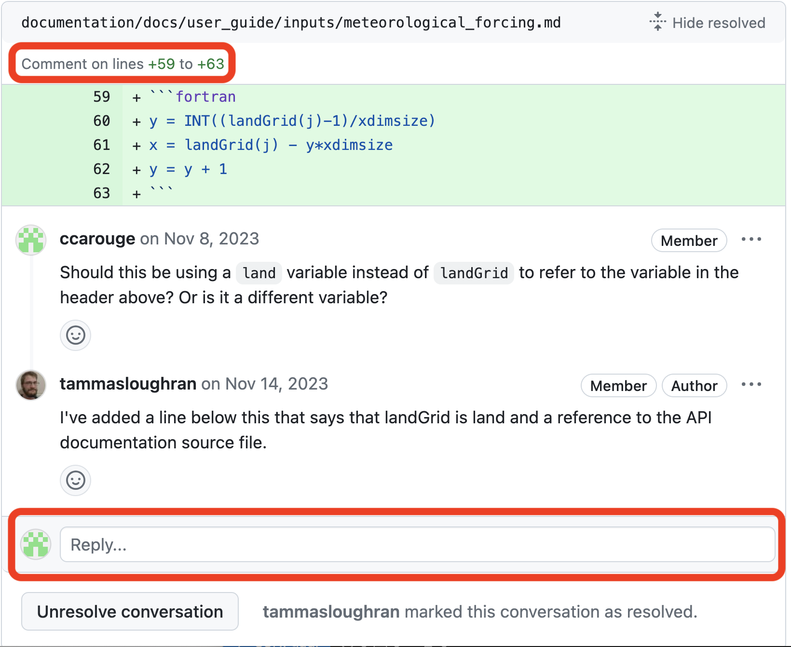
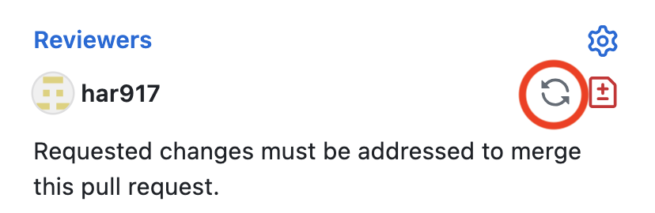

# How-to

Below you will find details instructions on how to follow various steps of the contribution guidelines with GitHub and git.

## Cloning a repository

On [CABLE's GitHub main page][CABLE-repo], click the `code` green button, choose the SSH protocol and copy the URL you need:
<figure markdown>
  { width="90%", align=right }
</figure>
On your local machine in a terminal, clone the repository:

```bash
git clone <URL provided>
```

!!! tip "Change the protocol after cloning"

    It is possible to change the access protocol to GitHub in your cloned repository if you realise you have chosen the wrong protocol, ie.:
    
    - you have cloned using the HTTPS protocol but have SSH keys setup with GitHub
    - or you have cloned using the SSH protocol but you have a personal access token setup with GitHub

    To do this, follow the steps:

    1. Remove the current remote repository
    ```
    git remote rm origin
    ```
    2. Add the new remote repository
    ```
    git remote add origin <URL>
    ```
    3. Reset the connection between your local and remote branches (this can be done at any time). Do this for your current branch and `main` at least.  Checkout each branch you want to reset and type:
    ```
    git branch -u origin/<branch_name>
    ```

## Assign an issue

When starting work on an issue, on that issue page on GitHub, assign yourself to that issue following the steps in the image:
<figure markdown>
  { width="90%", align=right }
</figure>

## Create a branch

Since we want to enforce a branch naming convention for CABLE, the simplest is to create the branch on the GitHub repository and then get that branch on your local repository.

1. Create the branch on GitHub:
    <figure markdown>
      { width="60%", align=left }
    </figure>

2. Keep all options to default on the confirmation pop-up window:
    <figure markdown>
       { width="40%", align=left }
    </figure>

3. Get the branch locally. Copy the commands given by GitHub and paste them in your terminal within your local repository.
    <figure markdown>
      { width="40%", align=left }
    </figure>

## Create a pull request (PR)

Once you push at least one commit to a new branch, you can create a pull request with the following steps:

1. Click New pull request:
    <figure markdown>
      { width="90%", align=right }
    </figure>

2. Check the branches are correct and continue
    <figure markdown>
      { width="90%", align=right }
    </figure>

3. Fill the description as best you can. The CABLE pull requests will come with a template to guide you through the information needed. The description and the title are editable at any time. It is often impossible to give the whole description at the start of the PR.
    <figure markdown>
      { width="90%", align=right }
    </figure>

## Review

### Ask for a review

To ask for a review, on the pull request screen, click on the Reviewers menu or its cog icon and choose the `CABLE-LSM/reviewers` team:
    <figure markdown>
      { width="90%", align=right }
    </figure>

### Understand a review

Reviewers can either leave comments or suggestions during the review. All of these need to be resolved to finish the current review. The GitHub documentation has more information about reviews, in particular around [comments on PR][github-commentPR] and how to [incorporate feedback][github-feedback].

#### Suggestions from the reviewer

A reviewer can directly suggest a specific code change. These suggestions appear like this:
    <figure markdown>
       { width="90%", align=right }
    </figure>

These suggestions can be directly applied within GitHub without requiring the author to copy them to their own local branch. It is recommended to:

- first apply the suggestions you agree with via GitHub
- then update your local branch with `git pull`
- apply other changes required by the review locally to the branch
- and finally push the fully revised version to GitHub (`git push`)

#### Comments from the reviewer

These comments can be:

- generic to the whole set of changes
- attached to a specific file
- or attached to a specific set of modified lines in a file

Comments to a specific set of lines look like this:
    <figure markdown>
       { width="90%", align=right }
    </figure>

It shows the specific lines commented on and the comment from the reviewer and it allows to reply to that specific comment.

Changes arising from these comments need to be applied on your local repository.

### Request a re-review

Once you have finished addressing all the comments from the reviewer, you should ask the reviewer to re-review the pull request:
    <figure markdown>
       { width="90%", align=right }
    </figure>

You will only be able to merge you work after getting approval from a reviewer.
  
[CABLE-repo]: https://github.com/CABLE-LSM/CABLE
[github-commentPR]: https://docs.github.com/en/pull-requests/collaborating-with-pull-requests/reviewing-changes-in-pull-requests/commenting-on-a-pull-request
[github-feedback]: https://docs.github.com/en/pull-requests/collaborating-with-pull-requests/reviewing-changes-in-pull-requests/incorporating-feedback-in-your-pull-request
