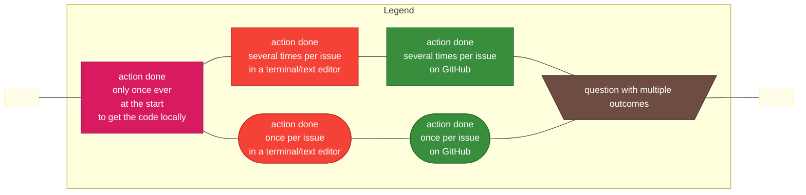
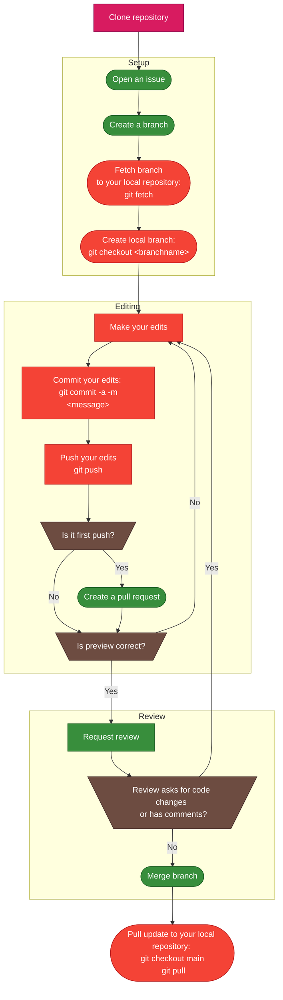

---
hide:
  - toc
---

# Flowchart to contribute to CABLE's documentation

```mermaid
   flowchart LR
   V[" "]---U[action done <br> only once ever <br> at the start <br> to get the code locally]:::uniq;;
   subgraph Legend
      P[action done <br> several times per issue <br> in a terminal/text editor]:::term;
      Q[action done <br> several times per issue <br> on GitHub]:::github;
      R([action done <br> once per issue <br> in a terminal/text editor]):::term;
      S([action done <br> once per issue <br> on GitHub]):::github;
      T[\question with multiple outcomes/]:::question;
      U---P---Q---T;
      U---R---S---T;
   end
   T---W[" "]

   classDef default fill:#FFFDE7, stroke:#FFF59D;
   classDef uniq fill:#D81B60, stroke:#880E4F, color:#FFFFFF;
   classDef github fill:#388E3C,stroke:#1B5E20, color:#FFFFFF;
   classDef term fill:#F44336, stroke:#B71C1C, color:#FFFFFF;
   classDef question fill:#6D4C41, stroke:#3E2723, color:#FFFFFF; 
;
```

```mermaid
   flowchart TB
   A[Clone repository]:::uniq --> B([Open an issue]):::github;
   subgraph Review
      L --> M[\Review asks for code changes <br> or has comments?/]:::question;
      M -->|No|N([Merge branch]):::github;
   end
   subgraph Editing
      F --> G["Commit your edits: <br> git commit -a -m &lt;message&gt;"]:::term;
      G --> H[Push your edits <br> git push]:::term;
      H --> I[\Is it first push?/]:::question;
      I -->|Yes|J([Create a pull request]):::github;
      I -->|No|K
      J --> K[\Is preview correct?/]:::question;
      K -->|Yes|L[Request review]:::github;
      K -->|No|F;
      M -->|Yes|F;

   end
   subgraph Setup
      B --> C([Create a branch]):::github;
      C --> D([Fetch branch <br> to your local repository: <br> git fetch]):::term;
      D --> E(["Create local branch: <br> git checkout &lt;branchname&gt;"]):::term;
      E --> F[Make your edits]:::term;
   end
   N --> O([Pull update to your local repository: <br> git checkout main <br> git pull]):::term;

   classDef default fill:#FFFDE7, stroke:#FFF59D;
   classDef uniq fill:#D81B60, stroke:#880E4F, color:#FFFFFF;
   classDef github fill:#388E3C,stroke:#1B5E20, color:#FFFFFF;
   classDef term fill:#F44336, stroke:#B71C1C, color:#FFFFFF;
   classDef question fill:#6D4C41, stroke:#3E2723, color:#FFFFFF; 

;

```
