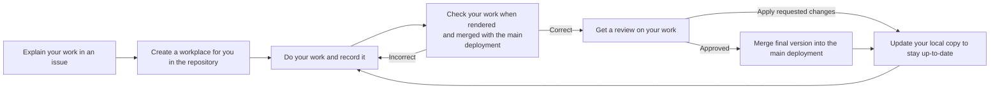
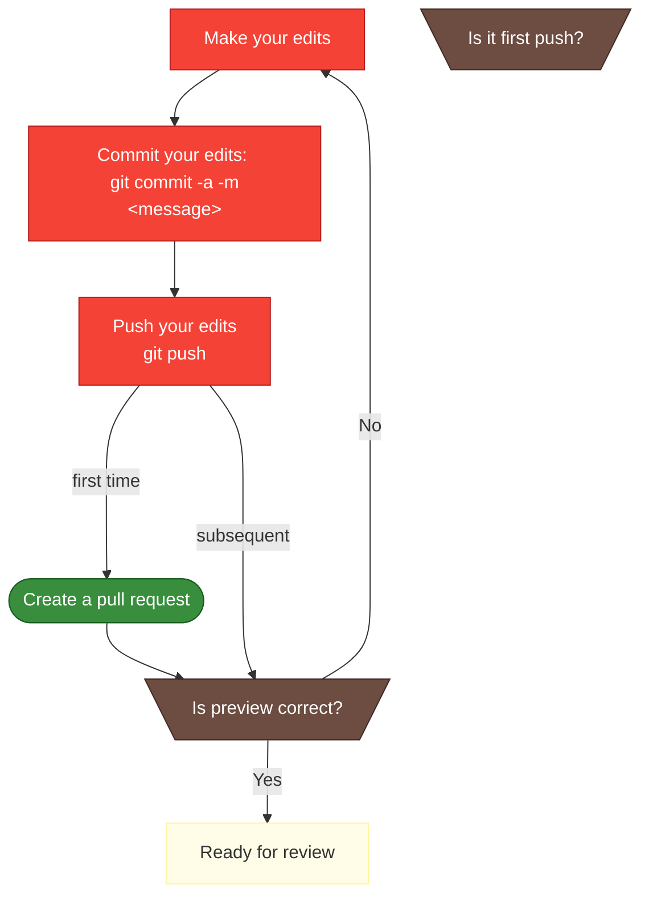
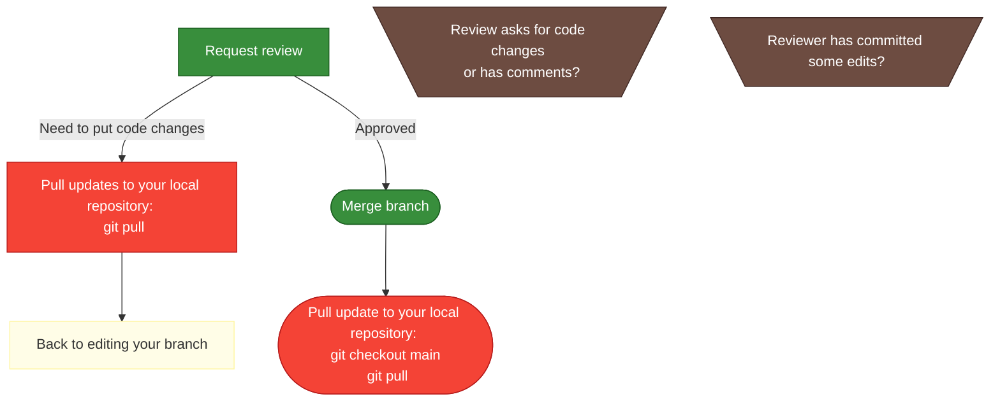

# Flowchart to contribute to CABLE's documentation

This workflow assumes you have followed all the steps to [setup Git and GitHub][git-training] given by ACCESS-NRI. 

This first flowchart explains what we are trying to do in various steps. The following flowcharts go into the details, including the various git commands needed or links to screenshots on GitHub.



## Legend for the flowcharts


## Setup for new piece of work


## **Clone repository**


Clone the repository to your local working space. Make sure to choose the appropriate protocol (HTTPS or SSH) for connecting to the remote repository. Note, you need to setup an access token to use HTTPS and SSH keys to use SSH.

## **Open issue**


Before starting new work, open an issue to explain what you are planning on working on. This avoid potential duplication of effort.

## **Create the local branch**

You want to create a branch for your work, that's your workplace within the shared repository. For this, use `git checkout` with the name of the branch you want:

```bash
git checkout <branchname>
```

:::tip "Branch name"

    It is best to start the branch name with the issue number so the link between the two is obvious.

## Do and record your work


## **Commit your edits**

You need to record your edits in git, this is called `commit`. It is recommended to do this regularly as it gives some safety to reverse changes:

```bash
git commit -a -m "your commit message"
```

## **Push your edits to the remote repository**

It is recommended to push your changes back to the remote repository often as it provides a backup of the work, the ability to work from different computers and makes it easier to collaborate on some development:

```bash
git push
```

The first time you push back some work on a branch, consider opening a pull request. This allows potential collaborators or helpers to find your work easily.


You can update the pull request by simply pushing more commits to the same branch.

## **Check the preview**

The pull request will build a preview of your work *merged* with the main branch of the repository. Please check that your work is rendered correctly. Once a preview is ready, you will see the following comment in the pull request providing the path to the preview:


To preview changes to the API documentation (ie. documentation in the CABLE source code), you need to append `/api` to the path provided.

## Review

All modifications to the documentation no matter how large or small need to be reviewed by another CABLE collaborator.



## **Ask for review**


Once you are satisfied with your work, ask for a review. By putting a submission in, you are responsible for being responsive to any comments or edit changes suggested by the reviewer. Remember your work will not be accepted into the main deployment branch until a reviewer approves it.

## **Merge your branch**

Once the reviewer(s) has(have) accepted your changes, you can merge your work into the main branch. Feel free to choose the merge method you prefer. "Merging" is the simplest and should be used if you don't understand what the other methods do.

## **Update your local repository**

Finally, don't forget to update your local repository to sync the main branch with the state of the remote repository. For this, you need to checkout main and then pull from the remote repository:

```bash
git checkout main
git pull
```

[git-training]: https://access-nri.github.io/Training/HowTos/GitAndGitHub/