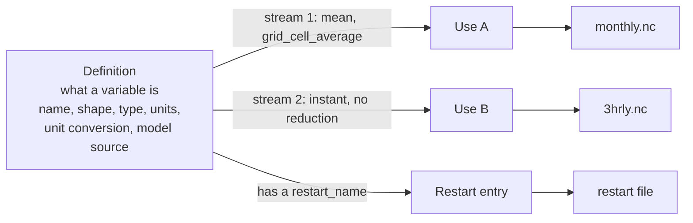
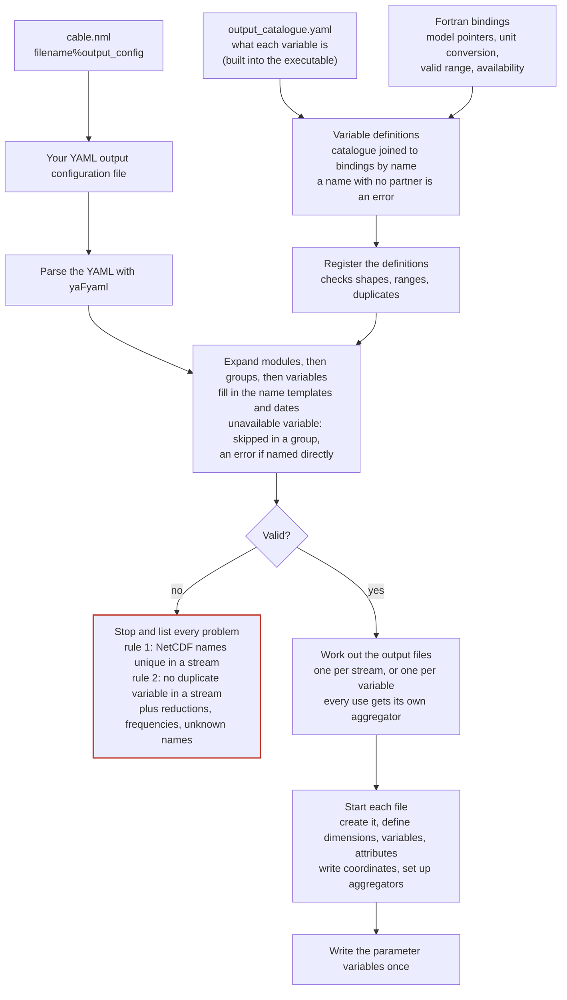
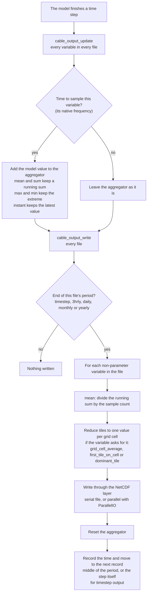
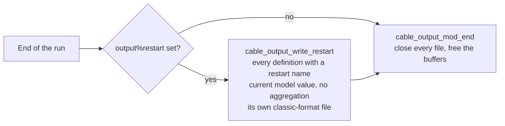

# How the output system works

Output is described by a YAML configuration made of **streams** (one file and one write frequency each) and the **variables** directed to them. At start-up CABLE joins a built-in catalogue of variables to Fortran bindings for the model state, reads and checks the configuration, and creates the files. On every time step it accumulates each variable and writes the files whose period has ended. The same path serves the serial and MPI drivers, and a run with no configuration file stops at start-up.

## What a variable, a use and a file are

A definition says what a variable is and is written once. Each time the configuration asks for it, that request becomes a use with its own aggregation, reduction, NetCDF name and aggregator, so the same variable can go to several files. Restart entries are separate: they are the model value as it is, not a use.

*One definition feeds any number of uses, and separately the restart file.*

## Start-up, once

The left branch builds the variable definitions, the right branch turns the configuration source into a checked list of uses. They meet in the expansion step, which is also where a group's unavailable variables are dropped. Problems are collected, not reported one at a time.

*Definitions and configuration are built independently and checked together before any file exists.*

## Every time step

Accumulating and writing are separate decisions. A variable is accumulated when the step matches how often the model itself updates it (usually every step). A file is written when the step ends its period. Parameter variables are skipped here because they were written once at start-up.

*Each file has its own clock: variables accumulate on every step and a file is written only at the end of its period.*

## End of the run

The restart file holds the current model state under the restart names, independent of what the configuration selected for output.

*The restart file does not depend on the output configuration.*

## Where the pieces live

| File | Role |
|---|---|
| `src/util/output/output_catalogue.yaml` | The catalogue: what each variable is (name, shape, type, units, groups, restart name). |
| `src/offline/cable_output_bindings*.F90` | Model state each name points at, unit conversion, valid range, availability. Generated once from the original definitions; edited by hand from now on. |
| `src/util/output/cable_output_catalogue.F90` | Joins the catalogue to the bindings. |
| `src/util/output/cable_output_config.F90` | Reads the YAML, expands groups and modules, fills in templates, applies the rules. |
| `documentation/main.py, catalogue_docs.py` | Build the user guide's variable catalogue page from the catalogue, the bindings and the valid ranges each time the documentation is built. |
| `src/util/output/cable_output.F90 and submodules` | The engine: streams, aggregation, reductions, defining and writing files. |
| `src/util/netcdf/` | NetCDF and ParallelIO layer, unchanged apart from optional compression. |
| `src/util/yaml/cable_yaml.F90` | Thin wrapper over yaFyaml; nothing else sees the library. |

## Things to know

- A file is compressed only if its stream sets `compression_level` above 0; such files are NetCDF-4, others are classic. Compression is not yet supported with ParallelIO.
- With `separate_file_per_variable`, each variable is written to `<netcdf_name>.nc` in the directory part of the stream's `file_name`.
- Streams that end up with no variables produce no file.
- The output% group switches, per-variable switches and patchout% switches no longer exist. `output%restart` and `output%grid` remain.
- Frequencies are `timestep`, `3hrly`, `daily`, `monthly` and `yearly`; aggregations are `instant`, `mean`, `max`, `min` and `sum`; reductions are `none`, `grid_cell_average`, `first_tile_on_cell` and `dominant_tile`. There are no aliases.
